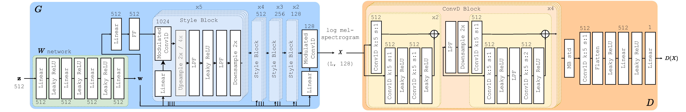

# AudioStyleGAN - ASGAN

This is the official code repo for the paper:

**GAN YOU HEAR ME? RECLAIMING UNCONDITIONAL SPEECH SYNTHESIS FROM DIFFUSION MODELS**

Links:
- arxiv: [https://arxiv.org/abs/2210.05271](https://arxiv.org/abs/2210.05271)
- audio sample demo page: [https://rf5.github.io/slt2022-asgan-demo/](https://rf5.github.io/slt2022-asgan-demo/)
- SLT 2022 proceedings: https://ieeexplore.ieee.org/document/10023153
- quickstart: see below



Figure: the architecture of the mel-spectrogram variant of ASGAN, as given in the paper.

---

## Quickstart

<p align="center">
    <a target="_blank" href="https://colab.research.google.com/github/RF5/simple-asgan/blob/master/asgan_quickstart_colab.ipynb">
        
    </a>
</p>

You can load the checkpoint of the best model from the paper (HuBERT variant of ASGAN) using torch hub, so no need to clone the repo!
Simply ensure that all libraries in `requirements.txt` are installed, and then:

```python
import torch
from torch import Tensor

model = torch.hub.load('RF5/simple-asgan', 'asgan_hubert_sc09_6')
model = model.eval()
# The below returns a batch of (4, 16000) one second waveforms 
# that you can directly save as .wav files.
audio = model.unconditional_generate(4)
```

The generator `nn.Module` is stored in `model.g` and dimensions of `w` and `z` latent variables are stored in `model.z_dim` and `model.w_dim`.
The model has four convenience functions:

```python
    def unconditional_generate(self, N: int) -> Tensor:
        """ Generate `N` unconditional audio samples, returning a tensor of shape (N, 16000) """

    def generate_from_latent(self, z: Tensor) -> Tensor:
        """ Generate waveforms (N, 16000) from latent standard normal `z` (N, z_dim) """

    def z2w(self, z: Tensor) -> Tensor:
        """ Generate latent w vectors (N, w_dim) from latent standard normal `z` (N, z_dim) """

    def generate_from_w(self, w: Tensor) -> Tensor:
        """ Generate waveforms (N, 16000) from W latent space `w` (N, w_dim) """
```

Simple!

## Training

For training you must also install [`deepspeed`](https://www.deepspeed.ai/).

### Preparing data

To prepare the data, use the HuBERT extractor provided in the `hubconf.py`.
Put simply:

1. Download the [Google Speech Commands dataset](https://ai.googleblog.com/2017/08/launching-speech-commands-dataset.html)
2. Extract the HuBERT `base` layer 6 features for each waveform and save them to some caching directory:

    ```python
      import torch
      import torchaudio

      hubert = torch.hub.load('RF5/simple-asgan', 'hubert_base')
      wav, sr = torchaudio.load('/path/to/google_speech_commands_utterance.wav')

      feats = hubert.get_feats_batched(wav) # (bs, seq_len, dim)
      torch.save(feats, '/path/to/hubert_feature_cache/uttr_hubert_feats.pt')
    ```
  
3. Use the train, test, and validation splits specified by the google speech commands dataset. I also provide a script to construct this for the SC09 dataset with `split_data.py`: `python --root_path /path/to/sc09/ --sc09_only True` . This will save train, validation, and test `.csv` files to `splits/`.

4. Set the `train_root` in `density/config` to the root directory of the saved hubert feature cache. This should have the same format as the Google Speech Commands dataset.

### Train script

Simply set the config you wish in `config.py` and then you can run the training script with:

```bash
python train_asgan.py model=rp_w train_root=/path/to/hubert_feature_cache/ n_valid=400 data_type=hubert_L6 checkpoint_path=./density/runs/cool_training_run/ z_dim=512 rp_w_cfg.z_dim=512 rp_w_cfg.w_layers=1 batch_size=16 lr=2e-3 grad_clip=10 aug_init_p=0.2 stdout_interval=100 validation_interval=2500 n_epochs=800 c_dim=768 rp_w_cfg.c_dim=768 d_lr_mult=0.1 fp16=True preload=False num_workers=12 betas=[0,0.99] rp_w_cfg.equalized_lr=True rp_w_cfg.use_sg3_ff=True rp_w_cfg.D_kernel_size=5 rp_w_cfg.D_block_repeats=[3,3,3,3] use_sc09_splits=True sc09_train_csv=./splits/train.csv sc09_valid_csv=./splits/valid.csv rp_w_cfg.r1_gamma=0.1
```

Logs will be saved in the checkpoint path. Feel free to tune the training hyperparameters as you see fit.

### Repository structure:

The repository is organized as follows: 

```
├── density
│   ├── augment.py                  # ADA and update skipping
│   ├── config.py                   # hyperparameters
│   ├── dataset.py                  # data loading and processing
│   ├── __init__.py
│   ├── losses.py                   # training loss
│   ├── metrics.py                  # logging and evaluation metrics
│   └── models.py                   # model definition
├── hubconf.py                      # torchhub integration
├── hubert_feature_reader.py        # fairseq hubert feature extractor
├── README.md
├── requirements.txt
├── split_data.py                   # splits data into train/valid/test subsets
└── train_asgan.py                  # main training script
```

## Acknowledgements

Parts of code for this project are adapted from the following repositories -- please make sure to check them out! Thank you to the authors of:

- https://github.com/facebookresearch/fairseq/ 
- https://github.com/jik876/hifi-gan
- https://github.com/bshall/hifigan
- https://github.com/NVlabs/stylegan3

## Citation

For the SLT proceedings:

```bibtex
@inproceedings{baas2022asgan,
  title={{GAN} you hear me? Reclaiming unconditional speech synthesis from diffusion models},
  author={Baas, Matthew and Kamper, Herman},
  booktitle={IEEE SLT},
  year=2022
}
```
